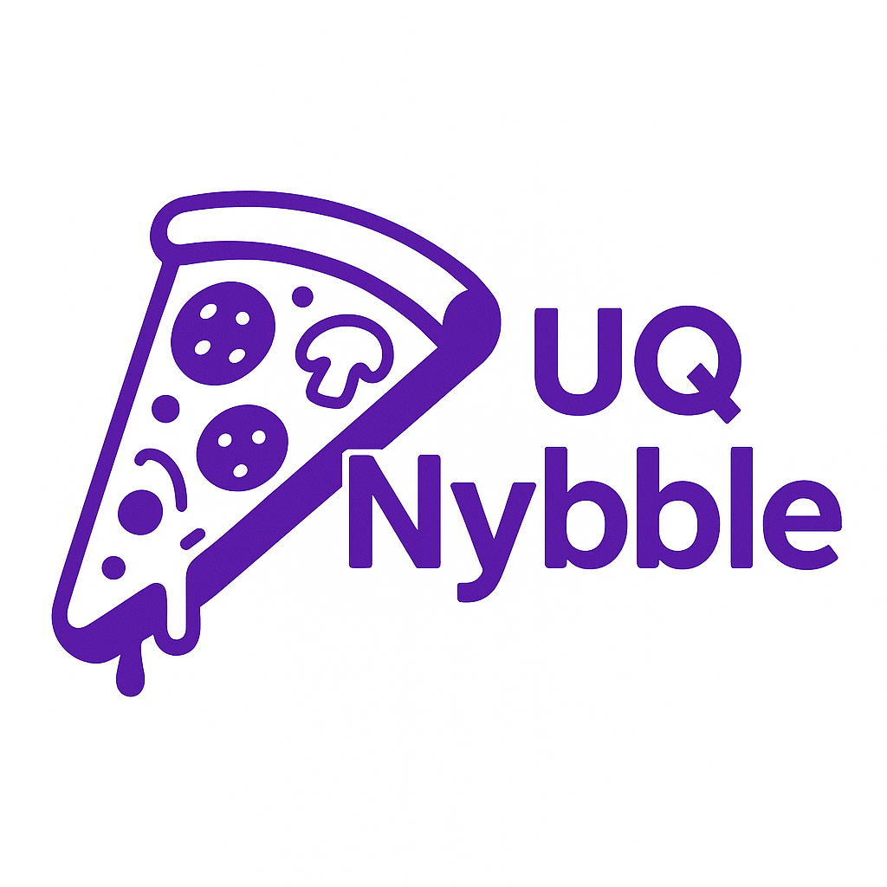

# UQ-nybble


_[NOT AFFILIATED WITH UQ]_  
Welcome all starving uni students.  
A website to find free events on UQ campus which you may be able to get free food from.

## Visit Online

deployed at [https://uq-nybble.onrender.com/](https://uq-nybble.onrender.com/)

## Build Locally

To build the project locally run the following commands:

(MacOS)

```bash
git clone https://github.com/nybble-TM/UQ-nybble
cd UQ-nybble
python3 -m venv .venv
source ./.venv/bin/activate
pip install -r requirements.txt
python3 app.py
```

change as required for Windows and Linux.

## AI usage

ChatGPT and Google Gemini has been used in basically every file and then a bunch of human editing on top to make it actually work.
